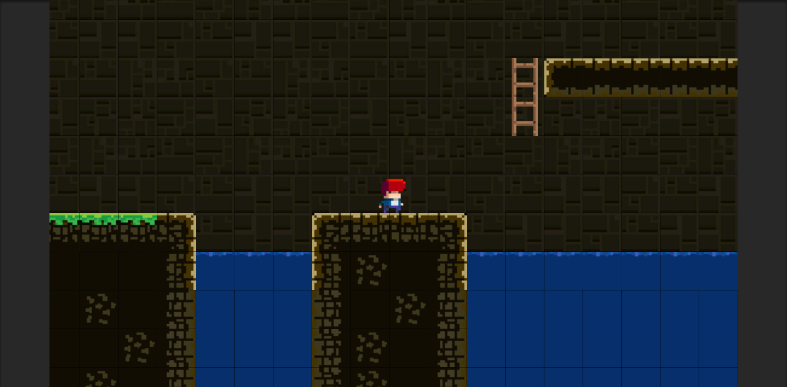
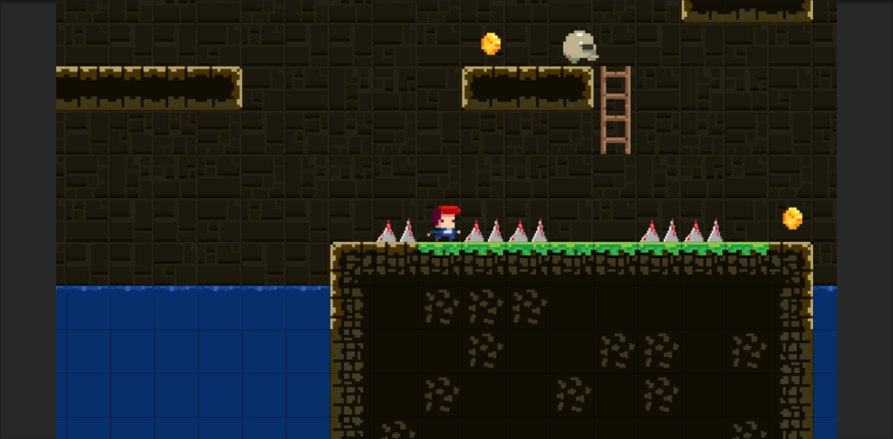
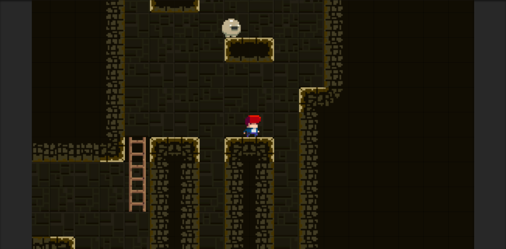

# TileVania

A simple, single-player platformer in which the player's goal is to 
reach the end of the map without dying to various obstacles. The game 
has two maps in total and a couple of gold coins to collect.

Made with Unity 2019.

# Controls and Mechanics

-A and D keys to move left and right.

-W and S keys to move up and down on ladders.

-Spacebar to jump.

-The player has three lives in total, and if they run out of lives, they have to restart the game from the beginning.

-There are coins scattered around the maps for players to collect if they want.

# Screenshots

